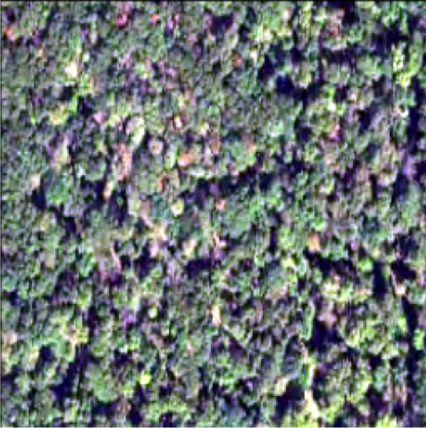

# 🌲 Dead Tree Segmentation Project


## 🎯 Project Overview

  

This project addresses the critical environmental challenge of monitoring forest health through automated dead tree detection. Using 4-channel aerial imagery (RGB + Near-Infrared), we implement and compare multiple semantic segmentation models to achieve accurate pixel-level classification of dead vegetation.

  

### Key Features

-  **Multi-channel Input**: RGB + NIR (Near-Infrared) 4-channel image processing

-  **Multiple Architectures**: Implementation of UNet, UNet++, SegFormer, DeepLabv3, and DeepLabv3+

-  **Dual Evaluation Metrics**: Both Mean IoU (mIoU) and Dead Tree-specific IoU analysis

-  **Robust Data Pipeline**: Comprehensive preprocessing with stratified cross-validation

-  **Performance Analysis**: Detailed cross-validation results and timing benchmarks

##  🛠️ Tech Stack
-  **Languages**: Python  

-  **Frameworks**: PyTorch, Segmentation Models PyTorch (SMP)
  
-  **Computer Vision**: OpenCV, Albumentations  

-  **Data Science**: NumPy, Pandas, Matplotlib  

-  **Deployment**: Streamlit, Google Colab, Hugging Face Spaces  

-  **Tools**: Git, Jupyter Notebook
  
## 🖼️ Example Results


| Input RGB | Ground Truth | UNet++ Prediction |
|-----------|--------------|-------------------|
|  |  |  |

More qualitative comparisons (all 5 models) are available in the [`results/`]


## 📊 Model Performance Overview

  

### Mean IoU-focused Models（in training）

| Model | Val mIoU | Val Dice | Val Pixel Acc |

|-------|----------|----------|---------------|

| **UNet** | 0.714 ± 0.011 | 0.614 ± 0.019 | 0.984 ± 0.002 |

| **UNet++** | 0.717 ± 0.018 | 0.618 ± 0.033 | 0.984 ± 0.002 | 

| **SegFormer** | 0.702 ± 0.015 | 0.795 ± 0.023 | 0.981 ± 0.003 |

| **DeepLabv3** | 0.663 ± 0.026 | 0.512 ± 0.055 | 0.980 ± 0.002 | 

| **DeepLabv3+** | 0.697 ± 0.015 | 0.581 ± 0.031 | 0.983 ± 0.001 |
  

### Dead Tree IoU-focused Models

| Model | Dead Tree IoU | Val Dice | Inference Speed |

|-------|---------------|----------|-----------------|

| **UNet (Dead Tree Focus)** | 0.443 ± 0.033 | 0.618 ± 0.041 | - |

| **UNet++ (Deep Supervision)** | 0.415 ± 0.002 | 0.581 ± 0.004 | - |

| **SegFormer** | 0.434 ± 0.030 | 0.596 ± 0.027 | 68.31 FPS |

| **DeepLabv3** | 0.349 ± 0.049 | 0.512 ± 0.055 | - |

| **DeepLabv3+** | 0.413 ± 0.029 | 0.581 ± 0.031 | - |

  

## 🚀 Quick Start

  

### Data Preprocessing

```python

from data_preprocess.four_channel_data_preprocessing import DeadTreeDataPreprocessor

  

# Initialize preprocessor with stratified sampling

preprocessor = DeadTreeDataPreprocessor(

dataset_root="path/to/USA_segmentation",

random_seed=42,

stratification_bins=4,

test_split_ratio=0.2,

k_folds=5

)

  

# Load and validate dataset

success = preprocessor.load_and_preprocess_dataset()

  

# Create stratified cross-validation splits

splits = preprocessor.create_stratified_splits(train_val_ratio=0.8)

  

# Generate comprehensive statistics

report = preprocessor.generate_statistics_report()

print(report)

```

  

## 🔬 Technical Implementation

  

### Model Architectures

  

#### 1. UNet Family

-  **UNet**: Classic encoder-decoder with skip connections

-  **UNet++**: Enhanced with nested skip connections and deep supervision

-  **Specialized Focus**: Versions optimized for either mIoU or Dead Tree IoU

  

#### 2. SegFormer

-  **Architecture**: Transformer-based hierarchical encoder with lightweight decoder

-  **Performance**: Best balance of accuracy and inference speed (68.31 FPS)

-  **Multi-scale**: Efficient multi-scale feature extraction

  

#### 3. DeepLab Family

-  **DeepLabv3**: Atrous convolution with ASPP (Atrous Spatial Pyramid Pooling)

-  **DeepLabv3+**: Enhanced decoder with fine-grained feature recovery

  

### Data Pipeline Features

-  **4-channel Processing**: RGB + NIR channel alignment and validation

-  **Stratified Sampling**: Dead tree ratio-based stratification for balanced training

-  **Cross-validation**: 5-fold CV with stratified splits

-  **Augmentation**: Synchronized transformations for image-mask pairs

-  **Quality Control**: Comprehensive validation and error handling

  

## 📈 Evaluation Metrics

  

### Primary Metrics

-  **Mean IoU (mIoU)**: Overall segmentation quality

-  **Dead Tree IoU**: Specific performance on dead tree detection

-  **Dice Coefficient**: Overlap-based similarity measure

-  **Pixel Accuracy**: Overall pixel-level classification accuracy

  

### Timing Analysis (SegFormer)

-  **Optimal Batch Size**: 16

-  **Maximum FPS**: 68.31

-  **Average Inference Time**: 14.64ms per sample

-  **Hardware**: Tesla T4 GPU, 14.7GB Memory

  

## 📜License

  

MIT License © 2025

  

---

  

**Last Updated**: September 2025
